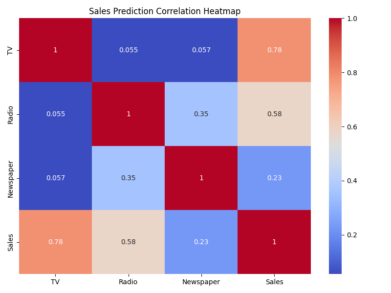
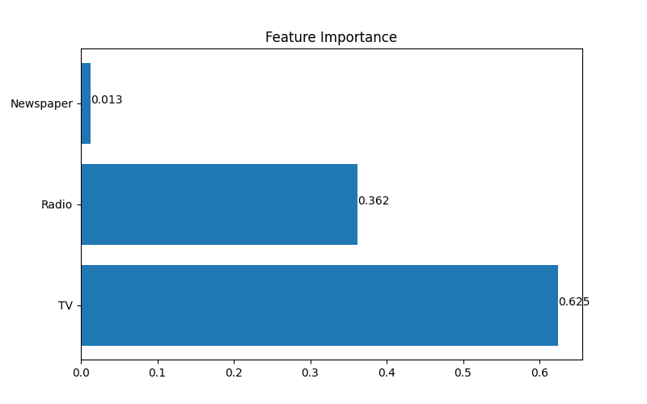
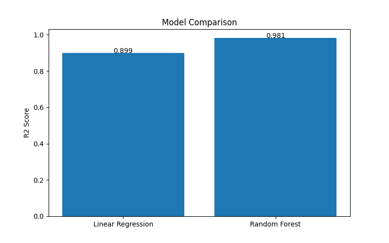

# 📈 Sales Prediction using Machine Learning

## 📌 Project Overview

This project predicts product sales based on advertising budgets spent on different marketing channels such as:

- 📺 TV Advertising
- 📻 Radio Advertising
- 📰 Newspaper Advertising

The application uses Machine Learning algorithms to analyze advertising data and forecast sales accurately.

A professional Streamlit web application is included for real-time sales prediction.

---

## 🚀 Features

✅ Data Analysis

✅ Correlation Heatmap

✅ Feature Importance Visualization

✅ Model Comparison

✅ Sales Prediction using Machine Learning

✅ Prediction History Tracking

✅ Interactive Streamlit Dashboard

✅ Professional User Interface

---

## 📂 Dataset Information

The dataset contains advertising budgets across different marketing channels and their corresponding sales figures.

### Features

| Feature | Description |
|----------|-------------|
| TV | TV Advertising Budget |
| Radio | Radio Advertising Budget |
| Newspaper | Newspaper Advertising Budget |

### Target Variable

| Target | Description |
|---------|-------------|
| Sales | Product Sales |

### Dataset Statistics

- Total Records: 200
- Missing Values: 0
- Features: 3
- Target Variable: Sales

---

## 🤖 Machine Learning Models Used

### 1️⃣ Linear Regression

Performance:

- R² Score: 0.8994
- MAE: 1.4608

### 2️⃣ Random Forest Regressor

Performance:

- R² Score: 0.9813
- MAE: 0.6203

🏆 **Random Forest Regressor** was selected as the final model due to its superior performance.

---

## 📊 Visualizations

### 🔥 Correlation Heatmap

Shows the relationship between advertising channels and sales.

### 📈 Feature Importance

Displays how much each feature contributes to sales prediction.

### 📉 Model Comparison

Compares the performance of Linear Regression and Random Forest models.

---

## 🖥️ Streamlit Dashboard

### Main Application


---

## 📸 Project Screenshots

### 🔥 Correlation Heatmap



---

### 📈 Feature Importance



---

### 📉 Model Comparison



---

## 📌 Key Insights

- 📺 TV advertising has the strongest impact on sales.
- 📻 Radio advertising positively influences sales performance.
- 📰 Newspaper advertising contributes less compared to TV and Radio.
- 🌲 Random Forest achieved the highest prediction accuracy.
- 🎯 Model Accuracy (R² Score): 98.13%
- 📉 Mean Absolute Error (MAE): 0.62

---

## 🖥️ Streamlit Application Features

The application allows users to:

- Enter advertising budgets
- Predict sales instantly
- View prediction history
- Explore visualizations
- Understand model insights
- Interact with a user-friendly dashboard

---

## 🛠️ Technologies Used

- Python
- Pandas
- NumPy
- Matplotlib
- Seaborn
- Scikit-Learn
- Joblib
- Streamlit

---

## ⚙️ Installation

### Clone Repository

```bash
git clone https://github.com/vinaytuppati509/CodeAlpha_Sales_Prediction.git
```

### Navigate to Project Folder

```bash
cd CodeAlpha_Sales_Prediction
```

### Install Dependencies

```bash
pip install -r requirements.txt
```

### Run Streamlit Application

```bash
streamlit run app.py
```

---

## 📁 Project Structure

```text
CodeAlpha_Sales_Prediction
│
├── Advertising.csv
├── sales_prediction.py
├── app.py
├── sales_model.pkl
│
├── heatmap.py
├── feature_importance.py
├── model_comparison.py
│
├── screenshots
│   ├── app_dashboard.png
│   ├── heatmap.png
│   ├── feature_importance.png
│   └── model_comparison.png
│
├── requirements.txt
├── README.md
```

---

## 🎯 Results

| Metric | Value |
|----------|----------|
| Best Model | Random Forest Regressor |
| R² Score | 98.13% |
| MAE | 0.62 |

The model provides highly accurate sales predictions based on advertising budgets across multiple channels.

---

## 👨‍💻 Author

### Vinay Tuppati

**Aspiring Data Scientist | Machine Learning Enthusiast | Python Developer**

Currently focused on building real-world Machine Learning and Data Science projects through hands-on learning, internship experiences, and open-source contributions.

### Skills & Interests

- Machine Learning
- Data Science
- Artificial Intelligence
- Python Development
- Data Analytics
- Streamlit Applications

### Connect With Me

🔗 GitHub: https://github.com/vinaytuppati509

---

## 🙏 Acknowledgement

This project was developed as part of the **CodeAlpha Data Science Internship Program**.

The project demonstrates the implementation of Machine Learning techniques for Sales Prediction using advertising data and an interactive Streamlit dashboard.

---

⭐ If you found this project useful, consider giving it a star on GitHub.